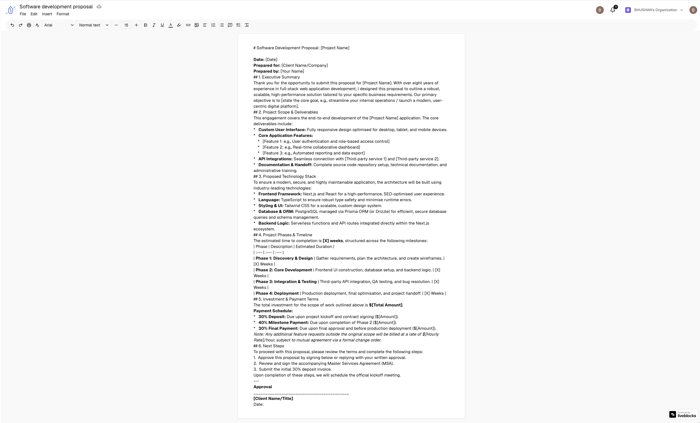
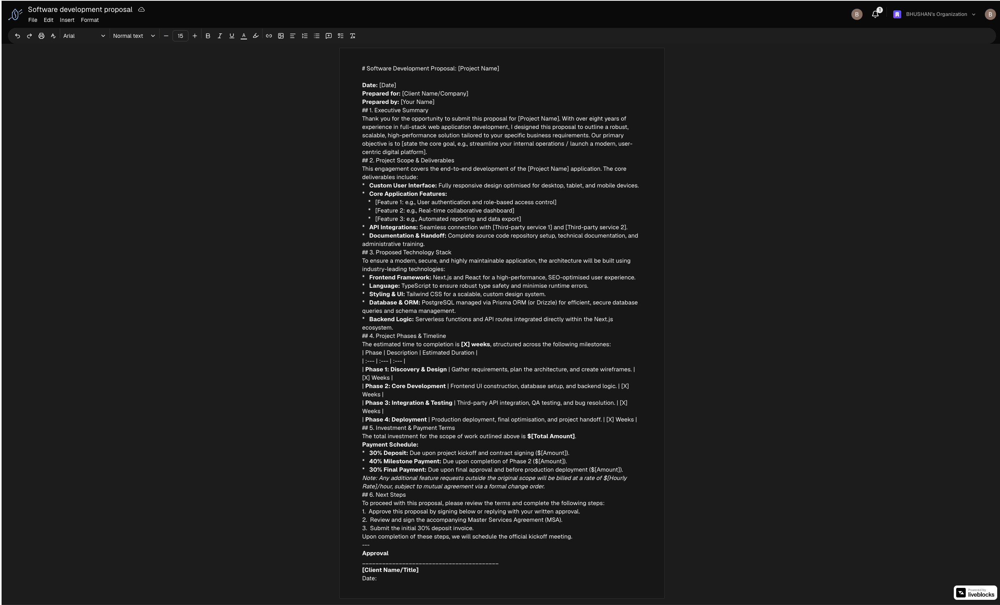
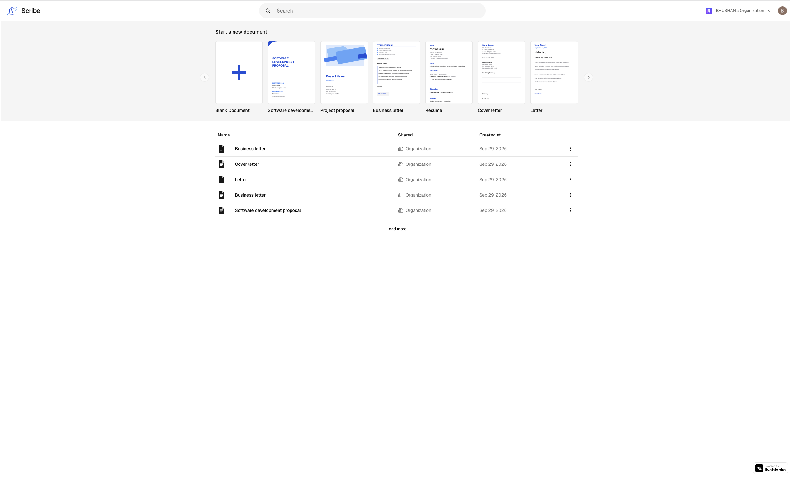
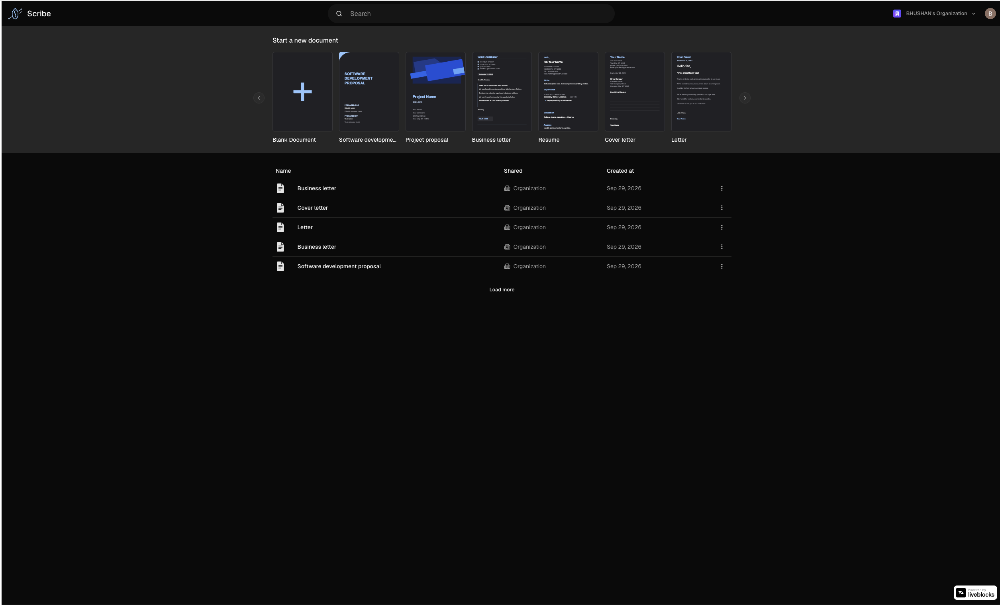
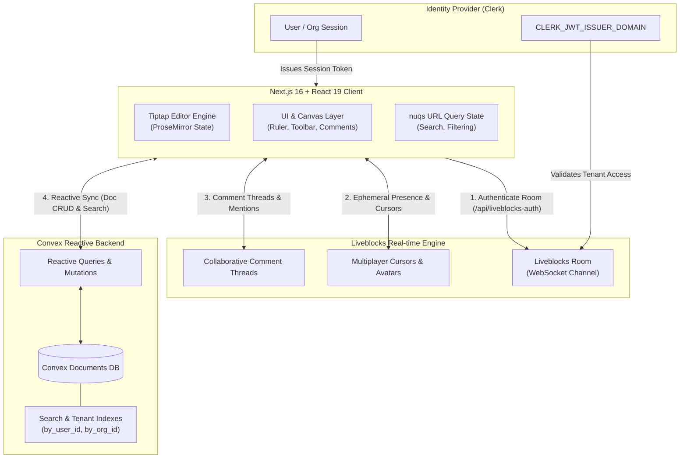

<div align="center">

# 📝 Next.js 16 Realtime Google Docs Clone

**A production-ready, full-featured collaborative document editor built with Next.js 16, React 19, Liveblocks, Tiptap, Convex, Clerk, and Tailwind CSS v4.**

[](https://nextjs.org/)
[](https://react.dev/)
[](https://tailwindcss.com/)
[](https://www.typescriptlang.org/)
[](https://liveblocks.io/)
[](https://www.convex.dev/)
[](https://clerk.com/)
[](https://opensource.org/licenses/MIT)

<br />

[🌐 **View Live Demo**](https://nextjs16-realtime-docs-clone.vercel.app) • [📂 **GitHub Repository**](https://github.com/BhushanLagare7/nextjs16-realtime-docs-clone) • [📖 **Architecture Docs**](./docs/architecture-overview.md) • [🐞 **Report Bug**](https://github.com/BhushanLagare7/nextjs16-realtime-docs-clone/issues)

</div>

---

## 📸 Visual Showcase & Previews

Experience the pixel-perfect dual-surface experience crafted with semantic OKLCH tokens, tailored for high-focus writing in both light and dark environments.

| Surface                                                                                                       | Light Mode                                                             | Dark Mode                                                            |
| :------------------------------------------------------------------------------------------------------------ | :--------------------------------------------------------------------- | :------------------------------------------------------------------- |
| **Document Editor & Canvas**<br />_Live multiplayer cursors, ruler, formatting toolbar, and comment threads_  |  |  |
| **Home Dashboard & Gallery**<br />_Document pagination, organization switcher, search, and template carousel_ |          |          |

---

## ✨ Key Features & Technical Highlights

### ⚡ Real-Time Multiplayer Collaboration

- **Live Collaborative Cursors**: Smooth cursor rendering via Liveblocks WebSockets with custom high-contrast name tags (`#ffffff` text) over personalized user colors.
- **Collaborator Avatars & Presence**: Dynamic avatar stack displaying active room participants and typing indicators with connection status gating (`useStatus`).
- **Secure Room Token Minting**: Server-to-server token resolution via `/api/liveblocks-auth` validating document ownership and tenant isolation before admission.

### 💬 Threaded Comments & Inbox Notifications

- **Contextual Comment Threads**: Attach discussions directly to document selections using Liveblocks `@liveblocks/react-ui`.
- **Floating Composer & Anchoring**: Responsive comment popovers anchored precisely to text marks.
- **Unified Inbox Notifications**: Global notification bell tracking mentions, replies, and unresolved threads across documents.

### ✍️ Custom Tiptap Rich-Text Engine

- **Custom Block-Level Extensions**: Bespoke `LineHeight` extension utilizing `setNodeMarkup` to isolate paragraph line spacing from inline text mutations.
- **Custom Inline Style Extensions**: Dedicated `FontSize` extension providing chained style commands without interfering with parent block formats.
- **Interactive Tables**: Full table grid manipulation—insert rows, columns, merge cells, and toggle headers.
- **Rich Media & Task Lists**: Interactive checklists with status toggling, code blocks, blockquotes, and resizable inline images.

### 📏 Interactive Canvas & Precision Ruler

- **816px Canonical Print Canvas**: Realistic Google Docs standard canvas layout with print media isolation (`print:bg-white`, `print:text-black`).
- **Dynamic Pointer Tracking**: Real-time margin markers tracking mouse movement across document margins.
- **Customizable Margins**: Left and right draggable margin sliders with persistent state storage.

### 🌓 Dual-Surface OKLCH Theming

- **Tri-Theme Engine**: Seamless switching between `light`, `dark`, and `system` themes powered by `next-themes`.
- **Zero Hardcoded Colors**: Strict adherence to semantic tokens (`bg-background`, `text-foreground`, `border-border`, `bg-card`) in OKLCH color space for zero-contrast degradation.
- **Print Media Isolation**: Print stylesheet isolating editor content to pure white backgrounds and black text on physical export.

### 🔍 Reactive Persistence & Search

- **Optimistic Convex Database**: Fully reactive, zero-latency document indexing with automatic cache revalidation.
- **URL-Driven Search**: Deep-linkable fuzzy search powered by `nuqs` state management with automatic debouncing.
- **Multi-Tenant Clerk Authentication**: Support for personal accounts and multi-member organizations with enterprise-grade RBAC.

### 🖨️ Multi-Format Document Export

- **One-Click Exports**: Export documents instantly to **PDF** (via browser print formatting), **HTML**, **JSON** (Tiptap ProseMirror node tree), and **Plain Text**.

---

## 🏗️ Architecture & System Design

The application implements a decoupled **3-way synchronization model** ensuring real-time multiplayer performance, reactive data consistency, and robust identity isolation.



### Architectural Separation of Concerns

1. **Client State (Tiptap + Zustand)**: Controls editor DOM selection, toolbar command dispatch, ruler marker coordinates, and local UI state.
2. **Multiplayer Ephemeral State (Liveblocks)**: Transmits high-frequency pointer coordinates, user presence halos, and threaded comment websockets without taxing the primary database.
3. **Persistent Document State (Convex)**: Manages durable document records, organization ownership boundaries, document titles, search index tokens, and reactive pagination.
4. **Identity & Authorization (Clerk)**: Minting JWTs consumed by both Convex queries and Liveblocks token exchange route handlers.

---

## 💻 Tech Stack

| Category                  | Technology                                                                    | Description                                                              |
| :------------------------ | :---------------------------------------------------------------------------- | :----------------------------------------------------------------------- |
| **Framework**             | [Next.js 16](https://nextjs.org/) (v16.3.4)                                   | React 19 App Router, async route params, server actions                  |
| **Frontend Library**      | [React 19](https://react.dev/) (v19.2.8)                                      | Modern concurrency, hooks, and clean client/server component boundaries  |
| **Real-time Multiplayer** | [Liveblocks](https://liveblocks.io/) (v3.24.2)                                | WebSockets, cursor presence, comments, inbox notifications, rooms        |
| **Rich-Text Engine**      | [Tiptap](https://tiptap.dev/) (v3.31.3)                                       | Headless ProseMirror wrapper with custom block and inline extensions     |
| **Database & Backend**    | [Convex](https://www.convex.dev/) (v1.46.0)                                   | Reactive real-time backend, reactive queries, indexing, server functions |
| **Authentication**        | [Clerk](https://clerk.com/) (v7.9.7)                                          | User authentication, organization switching, JWT session validation      |
| **Styling & Design**      | [Tailwind CSS v4](https://tailwindcss.com/)                                   | High-performance CSS engine with OKLCH theme tokens                      |
| **UI Components**         | [shadcn/ui](https://ui.shadcn.com/) / [Radix UI](https://www.radix-ui.com/)   | Accessible, customizable primitive UI components                         |
| **URL State**             | [nuqs](https://nuqs.47ng.com/) (v2.10.1)                                      | Type-safe search params synchronization for reactive search              |
| **Client State**          | [Zustand](https://zustand.docs.pmnd.rs/) (v5.0.15)                            | Lightweight global store for editor instance references                  |
| **Icons & Feedback**      | [Lucide React](https://lucide.dev/) & [Sonner](https://sonner.emilkowal.ski/) | Clean iconography and accessible toast notifications                     |

---

## 📂 Project Structure

```text
nextjs16-realtime-docs-clone/
├── app/                              # Next.js 16 App Router
│   ├── (home)/                       # Dashboard routes (search, templates, document list)
│   │   ├── page.tsx                  # Home dashboard entry point
│   │   ├── documents-table.tsx       # Reactive document list with pagination
│   │   ├── search-input.tsx          # nuqs URL debounced search bar
│   │   └── templates-gallery.tsx     # Embla carousel for quick document templates
│   ├── api/
│   │   └── liveblocks-auth/route.ts  # Liveblocks token authorization endpoint
│   ├── documents/[documentId]/       # Dynamic document editor route (async params)
│   │   ├── page.tsx                  # Server component resolving async params
│   │   ├── document.tsx              # Client document container with Liveblocks Room
│   │   ├── document-input.tsx        # Inline editable document title
│   │   ├── editor.tsx                # Tiptap canvas (816px) & editor mount
│   │   ├── navbar.tsx                # Document menubar, file operations, export actions
│   │   ├── ruler.tsx                 # Interactive 816px canvas ruler & margin markers
│   │   ├── toolbar.tsx               # Rich text formatting buttons & dropdown controls
│   │   ├── room.tsx                  # Liveblocks RoomProvider & boundary setup
│   │   └── avatars.tsx               # Active collaborator avatar stack
│   ├── layout.tsx                    # Root layout with NuqsAdapter, Convex, and Clerk
│   └── globals.css                   # Tailwind v4 theme definitions (OKLCH color space)
├── components/                       # Shared shadcn/ui & feature components
│   ├── convex-client-provider.tsx    # Convex + Clerk auth binding provider
│   ├── mode-toggle.tsx               # Tri-theme light/dark toggle button
│   └── ui/                           # Reusable primitive UI components
├── convex/                           # Convex backend functions & configuration
│   ├── schema.ts                     # Database schema definitions & indexing
│   ├── documents.ts                  # Document queries (get, getById) & mutations
│   └── auth.config.ts                # Clerk JWT validation config
├── extensions/                       # Custom Tiptap extensions
│   ├── font-size.ts                  # Custom inline font size mark extension
│   └── line-height.ts                # Custom block line height node extension
├── docs/                             # In-depth architectural & domain documentation
├── public/                           # Static assets, branding, and screenshots
│   └── screenshots/                  # High-res light & dark preview screenshots
├── store/                            # Global Zustand stores
│   └── use-editor-store.ts           # Editor instance reference management
└── package.json                      # Dependencies and verification scripts
```

---

## 🚀 Getting Started & Local Development

### Prerequisites

Make sure you have installed:

- **Node.js**: `20.9.0` or newer
- **npm**, **pnpm**, or **bun**
- Free accounts with **[Clerk](https://clerk.com/)**, **[Convex](https://www.convex.dev/)**, and **[Liveblocks](https://liveblocks.io/)**

### 1. Clone the Repository

```bash
git clone https://github.com/BhushanLagare7/nextjs16-realtime-docs-clone.git
cd nextjs16-realtime-docs-clone
```

### 2. Install Dependencies

```bash
npm install
```

### 3. Configure Environment Variables

Create a `.env.local` file in the root directory:

```bash
cp .env.example .env.local  # or create .env.local directly
```

Populate the following keys:

| Variable                            | Description                                          | Source                          |
| :---------------------------------- | :--------------------------------------------------- | :------------------------------ |
| `NEXT_PUBLIC_CONVEX_URL`            | Public URL for the Convex deployment                 | Convex Dashboard                |
| `CONVEX_DEPLOYMENT`                 | Deployment descriptor for Convex backend             | Convex CLI (`npx convex dev`)   |
| `NEXT_PUBLIC_CLERK_PUBLISHABLE_KEY` | Clerk publishable frontend key                       | Clerk Dashboard                 |
| `CLERK_SECRET_KEY`                  | Clerk secret backend key                             | Clerk Dashboard                 |
| `CLERK_JWT_ISSUER_DOMAIN`           | Clerk JWT issuer domain for Convex auth              | Clerk Dashboard (JWT Templates) |
| `LIVEBLOCKS_SECRET_KEY`             | Liveblocks secret key for server room authentication | Liveblocks Dashboard            |
| `NEXT_PUBLIC_LIVEBLOCKS_PUBLIC_KEY` | Liveblocks public key (optional fallback)            | Liveblocks Dashboard            |
| `NEXT_PUBLIC_APP_URL`               | Application root URL (e.g. `http://localhost:3000`)  | Local/Production URL            |

### 4. Initialize the Convex Backend

Run the Convex development process in a separate terminal:

```bash
npx convex dev
```

> This will connect to your Convex project, synchronize your database schema (`convex/schema.ts`), and generate type-safe API bindings under `convex/_generated/`.

### 5. Launch the Next.js Development Server

In your main terminal, start the Next.js app:

```bash
npm run dev
```

Open [http://localhost:3000](http://localhost:3000) in your browser to view the application.

---

## 🧪 Verification & Code Quality

This project enforces strict type safety and code quality standards:

```bash
# Run TypeScript typecheck (zero `any` policy)
npm run typecheck

# Check code formatting with Prettier & run ESLint
npm run format:check

# Run ESLint with automated fixes
npm run lint:fix

# Build the production bundle
npm run build
```

---

## 💡 Engineering Decisions & Invariants

- **Async Route Params in Next.js 16**: Dynamic route parameters (`params` and `searchParams`) in Next.js 16 are Promises. Every page and server action strictly `await`s them before consumption.
- **Tiptap Block vs. Inline Separation**: Block-level properties (e.g. `lineHeight`, `textAlign`) are applied exclusively to parent nodes via `setNodeMarkup`, preventing invalid ProseMirror inline span corruption.
- **Dual-Surface Zero-Contrast Theming**: Rather than relying on hardcoded hex codes or ad-hoc Tailwind colors, all surfaces use semantic CSS variables mapped to OKLCH tokens, preserving readability across monitors.
- **Optimistic Convex Mutation Pipelines**: Database updates trigger reactive query updates across all subscribed tabs instantly without requiring manual state re-fetching.

---

## 👤 Author

**Bhushan Lagare**

- GitHub: [@BhushanLagare7](https://github.com/BhushanLagare7)
- Project Repository: [nextjs16-realtime-docs-clone](https://github.com/BhushanLagare7/nextjs16-realtime-docs-clone)
- Live Deployment: [https://nextjs16-realtime-docs-clone.vercel.app](https://nextjs16-realtime-docs-clone.vercel.app)

---

## 📄 License

This project is licensed under the **MIT License** — see the [LICENSE](LICENSE) file for details.
